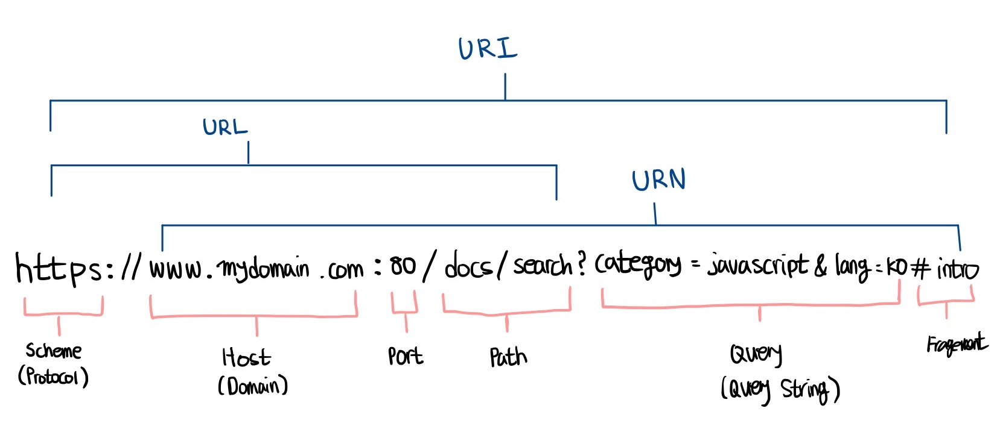
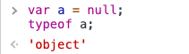
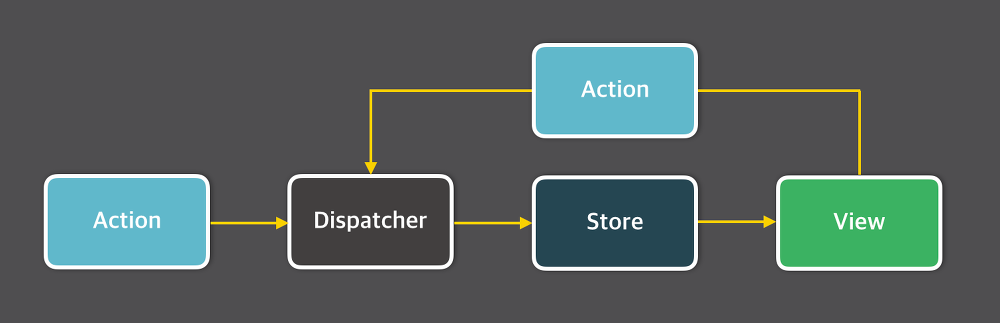

[이벤트 루프](#이벤트-루프)  
[CORS](#CORS)  
[이력서 기반](#이력서-기반)

# `CS`
## 1. 프로세스 VS 스레드
스레드는 프로세스 안에 포함되어 있는 단위로 프로세스는 프로그램을 실행하는 순간 파일이 메모리에 올라가게 되고, 스레드는 더 작은 실행 단위 개념이다.  
프로세스는 메모리에 올라갈 때 운영체제로부터 독자적인 시스템 자원을 할당받는 반면, 스레드는 프로세스 내부에서 다른 메모리 영역을 같은 프로세스 내 다른 스레드와 공유한다.

`프로세스`: 운영체제가 프로그램의 실행을 위해 메모리를 할당하는 단위  
`스레드`: 프로세스가 할당받은 메모리를 실행하는 단위
### 싱글 스레드
하나의 프로세스에서 하나의 스레드 실행 (하나의 레지스터와 스택)
#### 장점
- 자원 접근에 대한 동기화를 고려하지 않아도 됨.
- 멀티 스레드에서 공유된 자원을 사용할 경우 접근 통제 등의 비용이 생기는데, 단일 스레드 모델은 이런 작업을 생략 가능함.
- 작업전환 작업을 요구하지 않음
> 작업전환 ?  
> 여러개의 프로세스가 하나의 프로세서를 공유할 때 발생하는 작업 (**많은 비용 필요**)

#### 단점
- 여러개의 CPU를 활용하지 못함.
- 두개의 작업을 싱글 스레드, 멀티 스레드로 각각 처리할 때 후자의 경우 작업이 동시에 처리되는 것 처럼 보임.
  - 오히려 멀티스레드가 오랜 시간이 걸리는데 이는 스레드 간의 작업전환(Context Switching)에 시간이 걸리기 때문.

### 멀티 스레드
다수의 실행단위로 나누어 실행하여 프로세스 내의 자원을 공유하여 자원 생성, 관리의 중복을 최소화 (각 스레드마다 고유의 레지스터와 스택)
#### 장점
- 새로운 프로세스 생성보다 기존 프로세스에서 스레드를 생성하는 것이 더 빠름 (프로세스의 작업전환보다 스레드의 작업전환이 더 빠름)
- 프로세스의 자원과 상태를 공유하여 효율적
#### 단점
- 하나의 스레드만 실행할 땐 오히려 지연 (작업 전환)
- 멀티 스레딩을 위한 운영체제의 지원 필요
- 스레드 스케쥴링

## 2. HTTP
`HyperText Transfer Protocol`의 약자로 데이터를 주고받기 위한 통신 프로토콜이다. (브라우저와 서버 간의 데이터 통신)
### 특징
- `stateless` 프로토콜
> stateless ?  
> 각각의 데이터 요청이 서로 독립적으로 관리된다는 말. (전에 보냈던 데이터와 다음에 보낼 데이터 요청이 관련이 없다)
- 이런 특징 때문에 서버에서 세션같은 추가 정보를 관리하지 않아도 되고, 다수의 요청 처리 및 서버의 부하를 줄일 수 있음.
- HTTP 프로토콜은 일반적으로 TCP/IP 통신 위에서 동작하며 포트는 80이다.
### `HTTP/1.1` VS `HTTP/2.0`
HTTP/1.1은 커넥션 당 하나의 요청과 응답만 처리
- HTML 문서 내에 포함된 `link`, `img`, `script` 태그 등의 리소스 요청이 개별적으로 전송된다.

동시 전송이 불가능한 구조이므로 리소스 개수에 비례해 응답 시간이 증가하는 **단점**  
HTTP/2.0는 커넥션 당 다중 요청/응답이 가능  
HTTP/1.1에 비해 페이지 로드 속도가 50% 정도 빠르다고 알려짐

### `HTTPS` VS `HTTP`
HTTPS는 HTTP에 데이터 암호화가 추가된 프로토콜 (443번 포트)  
네트워크 중간에 제 3자가 정보를 볼 수 없도록 **공개키 암호화**를 지원


## URL
URL(Uniform Resource Locators)은 서버에 자원을 요청하기 위해 입력하는 영문 주소.
IP보다 기억하기 쉽다는 장점이 있다.  
URL로 되어있는 HTTP 요청을 DNS(Domain Name Server)를 통해 Host에 해당하는 실제 IP 주소로 변환하여 서버에 요청합니다.


## 쿠키와 세션
### 왜 쓰나요?
HTTP는 항상 연결된 것이 아닌 필요할 때마다 요청/응답을 받는 **비연결성**이라는 특징이 있다.  
이는 클라이언트가 응답을 받으면 서버와의 접속이 끊기고, 연결이 끝나면 상태 정보가 유지되지 않는 특성이 있다. (stateless)
> 로그인 한 뒤, 다른 도메인으로 이동했다가 돌아오면 로그인 정보가 유지되지 않는다는 것  

### 쿠키
사이트가 이용하는 서버에서 사용자의 컴퓨터에 저장하는 작은 기록 정보 파일이다.
#### 특징
- 이름, 값, 만료일, 경로 정보
- 총 300개의 쿠키 저장 가능
- 하나의 도메인 당 20개
- 하나의 쿠키는 4KB(=4096byte)까지 저장 가능
#### 동작 순서
1. 클라이언트에서 페이지 요청 -> 웹 서버에서 쿠키 생성
2. 쿠키를 HTTP 화면을 돌려줄 때 클라이언트에게 전달
3. 로컬 PC에 쿠키를 저장하고 서버에 재요청 시 쿠키를 함께 전송
4. 클라이언트에서 쿠키가 있는 경우, 오청 페이지와 함께 쿠키를 전송
#### 약점
- 클라이언트에 저장 (보안 취약)

#### 브라우저 저장소
브라우저 저장소는 크게 로컬 스토리지, 세션 스토리지, 쿠키 세가지로 나뉜다.  
**로컬 스토리지**는 도메인마다 생성되며 브라우저를 종료해도 된다.  
**세션 스토리지**는 페이징되고 있는 브라우저 내에서 유효하며 브라우저가 여러 개일 경우 각 브라우저 컨텍스트가 생성되기 때문에 다른 영역이 된다.  
**VS 쿠키** 쿠키는 매번 서버로 전송되기 때문에 비효율적인 측면이 있다.

### 세션
클라이언트와 서버가 연결된 순간부터 브라우저를 닫아 HTTP 통신이 끝날 때까지의 기간이다.  
하지만 보통 세션이라고 하면 서버에 대한 정보(세션 상태, 클라이언트 상태, 세션 데이터)등을 저장하는 걸 의미하는 경우가 많다.

#### 특징
- 용량 제한이 없다.
- 웹 브라우저가 종료되면 세션 쿠키는 삭제
#### 동작 방식
1. 클라이언트가 페이지를 요청
2. 서버가 클라이언트마다 개별의 세션 ID 부여
3. 클라이언트는 요청 시마다 세션 ID 전달
4. 서버는 받은 세션 ID로 클라이언트 정보를 가져온다.

### 차이점
**1. 저장 위치**  
    - 쿠키: 클라이언트에 파일로 저장  
    - 세션: 서버에 저장  
**2. 보안**  
    - 쿠키: 클라이언트의 브라우저에 저장되기 때문에 보안에 취약  
    - 세션: 쿠키를 이용해 세션 ID만 저장하고 서버에서 처리하기 때문에 비교적 안전  
**3. 라이프 사이클**  
    - 쿠키: 만료시간이 있기 때문에 브라우저를 종료해도 남아있다.  
    - 세션: 만료기간을 정할 수는 있지만 브라우저가 종료되면 삭제

**4. 속도**  
    - 쿠키: 속도가 빠름  
    - 세션: 정보가 서버에 있기 때문에 비교적 느림

## CORS
Cross Origin Resource Sharing의 약자로 교차 출처 공유  
Origin은 1. scheme, 2. host, 3. port 로 이루어진 도메인을 말합니다.
```
https://www.naver.com/

1. scheme: https
2. host: www.naver.com
3. port: 
```
현재 출처에서 다른 출처의 API에 요청하게 되면 이 응답이 안전한지 판단하게 되는데, 응답을 보내는 출처가 다르더라도 요청을 허용해주는 응답 헤더를 보내 브라우저가 응답 결과를 보여줍니다.

**왜 부러우저가 CORS 요청을 처리하나요?**  
모든 서버들이 다 CORS를 인지하지 않기 때문에 서버가 안전하게 요청을 주고받을 수 있도록 브라우저에서 요청을 처리합니다.

**실제 요청에서는 어떻게 처리하나요?**  
같은 Origin에서 통신하는 경우엔 Request Header가 알아서 들어가지만, 교차 출처로 요청하는 상황에선 그렇지 않습니다.
```
프론트 > WithCredentials: true

서버 > Access-Control-Allow-Credentials: true
```

## SaaS
서비스로서의 소프트웨어(Software-as-a-Service)는 클라우드 애플리케이션과 기본 IT 인프라 및 플랫폼을 사용자에게 제공하는 클라우드 컴퓨팅 형태입니다.

## CI/CD
애플리케이션 개발 단계를 자동화하여 보다 짧은 주기로 고객에게 제공하는 방법. 기본 개념은 지속적인 통합, 지속적인 배포입니다.  
`CI`는 지속적인 통합을 의미합니다. 코드 변경 사항이 정기적으로 빌드 및 테스트되어 통합되므로 여러 개발자들과 동시에 개발할 경우 서로의 충돌을 해결할 수 있습니다.  
`CD`는 지속적인 배포를 의미합니다. 변경 사항이 버그 테스트를 거쳐 자동으로 업로드되고 프로덕션 환경까지 자동으로 릴리즈 되는 것을 의미합니다.

## 웹팩
가장 많이 사용되는 모듈 번들러 입니다.
> 모듈 번들러 ?  
> 웹 애플리케이션을 구성하는 자원(HTML, CSS, Javascript, Images)을 모두 각각의 모듈로 보고 이를 조합하여 하나의 결과물을 만드는 도구
### 장점
1. 파일 단위의 자바스크립트 모듈 관리의 필요성
2. 웹 개발 작업 자동화 도구
3. 웹 애플리케이션의 빠른 로딩 속도와 높은 성능
### 주요 속성
1. entry
2. output
3. loader
4. plugin

`entry`
웹펙에서 자원을 변환하기 위해 최초 진입하는 곳이자 자바스크립트 파일 경로입니다. (빌드 대상 파일의 위치)
```javascript
// webpack.config.js
module.exports = {
    entry: './src/index.js'
};
```

`output`
웹팩을 돌리고 난 후 결과물의 파일 경로
```javascript
// webpack.config.js
module.exports = {
    output: {
        filename: 'bundle.js',
        path: path.resolve(__dirname, './dist')
    }
}
```

`loader`
로더는 자바스크립트 파일이 아닌 웹 자원(HTML, CSS, Images, 폰트 등)들을 빌드 시에 output 파일에 포함될 수 있도록 도와주는 속성

`plugin`
bundle.js에 css 파일을 같이 번들링 하는 것이 아닌 별도의 css 파일로 만들어주기 위해 플러그인을 사용

## 모듈
**특정 기능을 갖는 작은 코드 단위**를 의미합니다.
### 모듈 번들링
몇 백개의 자원들을 하나의 파일로 병합 및 압축해주는 동작을 모듈 번들링이라고 합니다.

## 바벨
자바스크립트에서 지원하는 최신 문법을 많은 브라우저 환경에서 호환되도록 트랜스파일링 해주는 언어
> 트랜스 파일?  
> 한 언어로 작성된 소스 코드를 비슷한 수준의 추상화를 가진 다른 언어로 변환 (eg. es6 -> es5)

## 타입과 인터페이스
### 쓰는 이유
정적 타이핑을 지원한다는 점. 타입을 지정함으로써 프로그래밍 단계, HTTP 통신을 통한 데이터를 주고받는 과정에서 생기는 데이터를 안전하게 주고 받을 수 있다. 
또한 타입을 미리 선언해주기 때문에 타입과 관련된 프로토타입 메서드를 손쉽게 사용할 수 있다는 장점이 있다.
### 타입 VS 인터페이스
객체의 타입 이름을 지정하는 방법들이다.
1. 확장하는 방법  
인터페이스는 `extends` 키워드를 사용해 확장이 가능하고 타입은 `&` 연산자를 통해 확장이 가능하다.
```javascript
interface PeopleInterface {
    name: string;
    age: number;
}

interface StudentInterface extends PeopleInterface {
    school: string;
}

type PeopleType {
    name: string;
    age: number;
}

type StudentType = PeopleType & {
    school: string;
}
```

2. 선언적 확장  
인터페이스는 동일한 이름을 재정의함으로써 선언적 확장이 가능하지만, 타입은 불가능하다.
```javascript
interface Window {
    title: string;
}

intreface Window {
    ts: TypeScriptAPI;
}

type Window = {
    title: string;
}

type Window = {
    ts: TypeScriptAPI;
}

// Error
```

## 제네릭
클래스, 함수, 인터페이스 등을 다양한 타입으로 재사용가능하게 해주는 문법

# `자바스크립트`
## 프로그래밍
프로그래밍이란 컴퓨터에게 실행을 요구하는 일종의 커뮤니케이션이다. 문제를 명확히 이해하고 적절한 해결 방은을 찾아 기계가 실행할 수 있을 정도로 요구를 설명하는 작업이며, 이 결과물이 바로 코드이다.

## 컴파일러와 인터프리터
프로그래밍 언어를 사용해 프로그램을 작성 후 컴퓨터가 이해할 수 있는 기계어로 변환해주는 번역기를 컴파일러(Compiler) 혹은 인터프리터(Interpreter)라고 한다.

## 자바스크립트의 특징
웹을 구성하는 요소 중 하나로 웹 브라우저에서 동작하는 유일한 프로그래밍 언어이다. 자바스크립트는 개발자가 별도의 컴파일 작업을 수행하지 않는 **인터프리터 언어**이다. 
자바스크립트는 런타임에 컴파일되며 실행 파일이 생성되지 않고 인터프리터의 도움 없이 실행할 수 없기 때문에 컴파일러 언어라고 할 수는 없다.

## 변수
변수는 값을 저장하기 위해 확보한 메모리 공간 자체 또는 그 공간을 식별하기 위해 붙인 이름을 말한다.

## 식별자
변수의 이름을 식별자(Identifier)라고도 한다. 식별자는 값이 아닌 메모리의 주소를 기억하고 있다. 변수 뿐만 아니라 함수, 클래스 등 메모리 상에 존재하는
값을 식별할 수 있는 이름은 모두 식별자라고 부른다.

## 자바스크립트 타입
- Number
- String
- Boolean
- Object
- Symbol
- Function
- undefined
- BigInt..?
> null은 object 타입이다.  
> 

## 스코프
### 함수 레벨 스코프
`var` 키워드로 선언한 경우 함수 레벨 스코프. 즉, 오로지 함수의 코드 블록만 지역 스코프로 인정합니다.
```javascript
var foo = 1;

{
    var foo = 10;
}
console.log(foo) // 10 의도치 않는 변경
```
### 블록 레벨 스코프
`let` 키워드를 통해 선언된 변수는 블록레벨 스코프를 따릅니다.
```javascript
let foo = 1;

{
    let foo = 2;
}
console.log(foo) // 1
```

## task queue
콜 스택에 들어가기 전 setTimeout, 사용자 이벤트 콜백 등이 저장되는 큐

## microtask queue
Promise.then 콜백이 저장되는 큐

## 이벤트 루프 ?
### 정의
메인 스레드 동작 타이밍을 관리하는 관리자 역할. 메인 스레드란 자바스크립트 코드 실행이나 브라우저 렌더링을 맡는 등 브라우저의 주된 동작이 수행되는 곳이다.
### 중요한 이유
**1. 브라우저 동작의 대부분이 메인 스레드에서 싱글 스레드로 실행된다.**

브라우저 렌더링을 포함하여 비동기 함수를 제외한 대부분의 자바스크립트는 메인 스레드라는 곳에서 실행된다.

싱글 스레드가 하나의 작업을 하고 있다면 다른 작업은 지연시키게 된다. 메인 스레드에서도 마찬가지로 싱글 스레드 작업이 이루어지는 동안 다른 작업들을 지연시키기 때문에 싱글 스레드 작업 관리는 매우 중요하다.
> 브라우저의 탭 마다 다른 프로세스로 동작됩니다.

**2. 메인 스레드는 이벤드 루프에 의해 관리된다.**  
메인 스레드와 같은 싱글 스레드에서 하나의 작업이 오랫동안 실행되는 것을 방지하기 위해 어떤 작업을 우선으로 동작시킬 것인가 결정하는 것이 매우 중요하다.  

이러한 컨트롤을 이벤트 루프가 하는 것이다.

### 동작
1. 콜 스택에 쌓여있는 task 정리
2. microtask queue에 등록된 Promise.then 콜백 실행
3. 화면 갱신이 필요하다면 렌더링 파이프라인으로 이동
4. task queue의 콜백 하나씩 실행

[더보기](https://tecoble.techcourse.co.kr/post/2021-08-28-event-loop/)


## 블로킹 VS 논블로킹
파이썬은 블로킹 언어이고 자바스크립트는 논블로킹 언어입니다. 자바스크립트는 연산이 끝나는 것을 기다리지 않아도 되기 때문에 비동기적 작업이 가능합니다. 그래서 어떠한 작업이 끝나고 이뤄져야 하는 작업들은 `async/await` 나 콜백함수를 사용해야 합니다.

## 자바스크립트의 이벤트 루프
자바스크립트는 기본적으로 싱글 스레드 이벤트 루프 형태입니다.  
자바스크립트는 Stack과 Queue를 갖고 있는데 setTimeout 같은 함수들은 Queue(task queue)로 들어가게 되고, 그 메시지가 실행되어야하는 상황에 Stack이 비어있다면 실행 됩니다.

## Hosting
자바스크립트에서 선언문들이 최상위로 끌어올려지는 것을 의미합니다.
[더보기](JavaScript/호이스팅.md)

## 클로저
클로저란 자신이 생성될 때의 환경을 기억하는 함수로, 외부 변수를 기억하고 그 변수에 접근할 수 있는 함수를 뜻합니다.
자바스크립트는 중첩 함수로 쉽게 클로저를 구현할 수 있습니다.  
원래 함수 내부 변수를 스코핑할 때는 렉시컬 스코핑을 따라서 그 전역 변수에 있는 값을 참조하게 됩니다. 하지만, 함수 내부에
다른 함수를 위치시킴으로서 내부 함수가 감싸는 environment를 참조하게 되고, 값을 저장하는 것이 가능하게 됩니다.
```javascript
var color = 'red'; 
function foo() { 
    var color = 'blue'; // 2 
    function bar() { 
        console.log(color); // 1 'blue'
    } 
    return bar; 
} 
var baz = foo(); // 3 
baz(); // 4 undefined
```
[더보기](JavaScript/closure.md)

## This
자바스크립트는 `this`라는 객체를 갖게 되는데, `this`는 호출된 상황에서 함수를 소유하고 있는 객체를 의미합니다.
전역 환경에서 `this`를 쓰게 되면, 그것은 `window` 객체를 의미합니다.

- `apply`: 메서드는 첫 번째 인자로 `this` 대상 객체를 보내고 두번째 인자로 배열이 온다.
- `call`: 메서드는 첫 번째 인자로 `this` 대상 객체를 보내고 두번째 인자로 배열이 아닌 일반 변수가 온다.
- `bind`: 메서드는 당장 호출되지 않고 함수가 리턴되는 형태로 필요한 때에 호출할 수 있다.

> `apply`, `call`, `bind`를 통해 `this`를 주입 혹은 추출이 가능하다.

## async/await
자바스크립트에서 Promise를 쉽게 사용하기 위한 것으로 비동기 작업을 할 때 사용되고, 콜백 hell이나 무한 then과 같은 보기 안좋은 코드를 깔끔하게 표현할 수 있습니다.

## 실행 컨텍스트
**코드의 실행 환경**  
코드가 실행하는 순간 페이지가 종료될 때까지 유지되는 **전역 실행 컨텍스트**가 생긴다.  
전역 컨텍스트 말고도 **함수 컨텍스트**가 있는데 이는 함수가 호출할 때마다 생긴다.

- 전역 컨텍스트 하나 생성 후, 함수 호출 시마다 컨텍스트가 생깁니다.
- 컨텍스트 생성 시 안에 **변수 객체 (arguments, variable), scope chain, this**가 생성됩니다.
- 컨텍스트 생성 후 함수가 실행되는데, 사용되는 변수들은 변수 객체 안에서 값을 찾고, 없다면 스코프 체인을 따라 올라가며 찾습니다.
- 함수 실행이 마무리되면 해당 컨텍스트는 사라집니다. (클로저 제외) 페이지가 종료되면 전역 컨텍스트가 사라집니다.

# function VS arrow function
- arrow function의 this는 바로 상위 스코프의 this와 같습니다. 하지만 function은 this가 동적으로 바인딩됩니다.
- function은 생성자 함수로 사용할 수 있지만, arrow function은 생성자 함수로 사용할 수 없습니다. (prototype 프로퍼티를 갖고 있지 않기 때문)
- function에서는 함수가 실행될 때 암묵적으로 arguments 변수가 전달되어 사용할 수 있지만, arrow function에서는 arguments 변수가 전달되지 않습니다.

## 바인딩 되지 않은 `this`
화살표 함수가 나오기 전까지는, 그 함수가 어떻게 호출되는지에 따라 자신의 `this` 값을 정의했습니다.
- 생성자 함수의 경우 새로운 객체
- strict 모드 함수 호출에서는 `undefined`
> strict 모드 ?  
> 기존에 조용히 무시되던 에러를 throwing 합니다.
- 함수가 객체의 메서드로서 호출된 경우 문맥 객체

## 바인딩 되지 않은 `arguments`
## 객체의 메서드 사용 X
## new 연산자 사용 X
화살표 함수는 생성자로서 사용될 수 없으며 `new`와 함께 사용하면 오류가 발생합니다.
## `prototype` 속성 사용 X

# React & Vue
## Vue
프로그레시브 프레임워크
> **프레임워크?**  
> 프레임에 맞춰 코드를 짜는 것 (따라서 Vue는 `.vue` 파일에 코드를 작성해야 한다.)

## React와 Vue
- **러닝커브: React > Vue**  
기본적인 HTML, CSS, Javascript를 사용할 줄 아는 개발자라면 Vue는 쉽게 학습할 수 있다. Vue에서 제공하는 디렉티브들 또한 명시적이고 어렵지 않은 부분이라 처음 프론트엔드 프레임워크를 사용한다면 Vue가 훨씬 쉬울거라고 생각한다.
- **타입스크립트 지원: React > Vue**  
Vue 프로젝트에 타입스크립트를 도입하다보니 많은 ts 모듈과 트러블슈팅을 했어야 했다. React는 앱을 생성할 때부터 Typescript를 함께 세팅할 수 있다는 부분에서 호환성이 더 좋은 것 같다.

# 이력서 기반
## Redux & Recoil
리액트에서 사용하는 전역 상태관리 라이브러리
### Redux
- Flux 패턴
- 하나의 root에 하나의 store

> **Flux 구조 ?**  
> 단방향 데이터 흐름(Dispatcher -> Store -> View) 을 갖습니다. 뷰에서 입력이 발생하면 Action을 통해 Dispatcher와 통신하게 됩니다.
> 

### Recoil
- Redux에 비해 보일러 플레이트 코드가 적고 러닝커브가 낮음
- Selector를 통해 atom을 읽기 전용으로 사용할 수 있고 가공, 비동기 처리도 가능함
- selectorFamily를 통해 파라미터에 따른 동적 데이터를 사용할 수 있음
- DevTools가 미흡함

## React Query
Server State를 관리하는 라이브러리
> **Server State ?**  
> - Clinet에서 제어하거나 소유되지 않은 원격의 공간에서 관리되고 유지됨
> - Fetching, Updating에 비동기 API가 필요함
> - 다른 사람들과 공유되는 것으로 사용자가 모르는 사이에 변경될 수 있음
> - 신경 쓰지 않는다면 잠재적으로 "out of date"가 될 가능성을 지님

API와 통신 시 lading, error, data 등 여러 state를 쉽게 관리할 수 있어 사용

## styled-components & emotion
> CSS 전처리기 ?  
> CSS 전처리기란 말그래도 CSS 전에 처리되는 것으로 결국 less, Sass 등이 있고 이는 결국 CSS로의 컴파일이 필요하다.

emotion이 상대적으로 성능이 좋고 크기가 작다.

## Nuxt & Next
Nuxt는 Vue 프레임워크의 SSR을 구현하기 위한 프레임워크, Next는 React 라이브러리의 SSR을 구현하기 위한 프레임워크이다.
> **React ?**  
> A JavaScript library for building user interfaces
> (UI를 구성하기 위한 자바스크립트 라이브러리)

## React Native
네이티브 앱 개발을 위한 React 프레임워크
- React 문법을 사용해 네이티브 앱 개발이 가능
- iOS, Android 앱을 동시에 개발 가능

# Refer
https://programming119.tistory.com/224?category=930152
